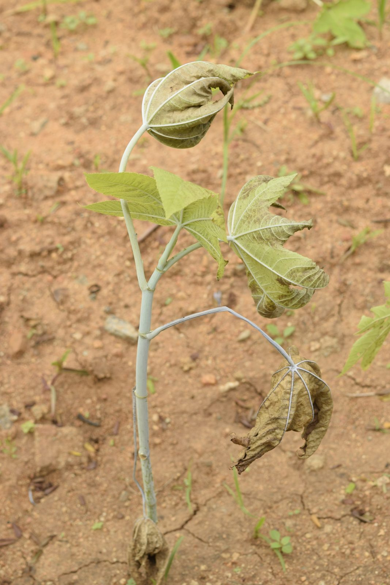
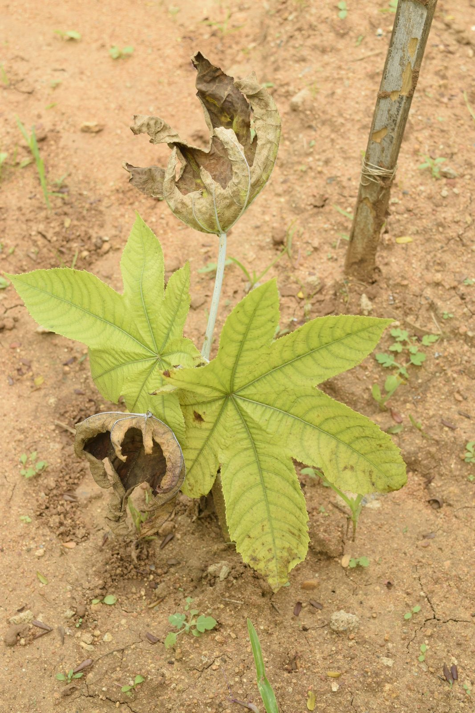
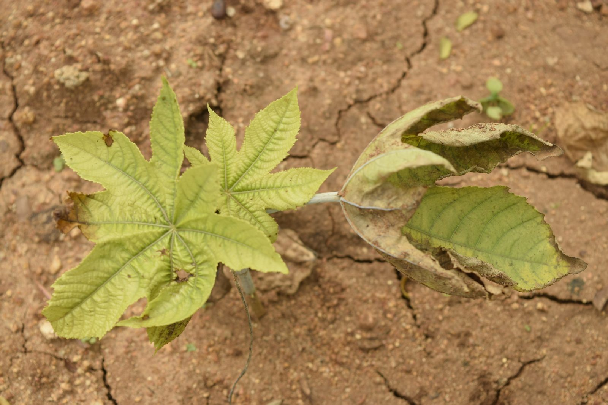
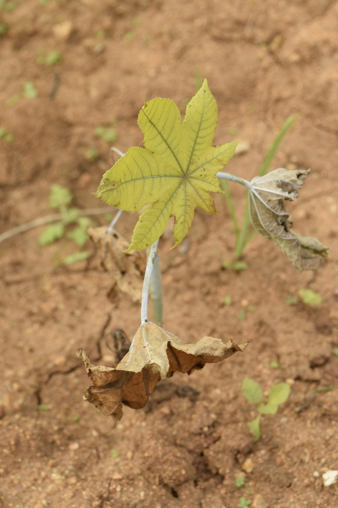
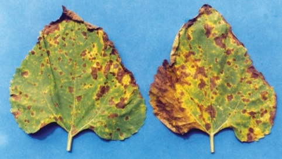
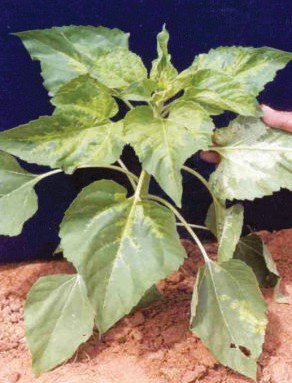
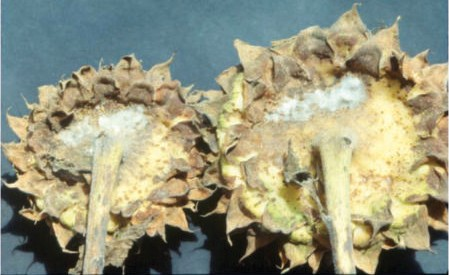
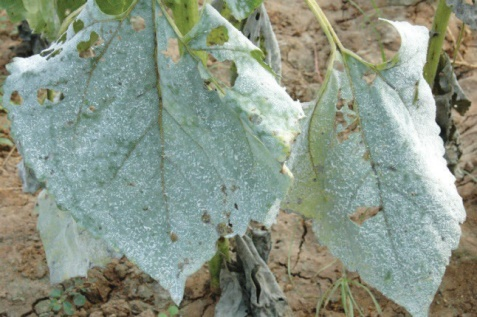
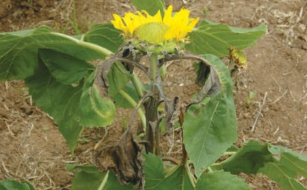

# 🌾 Kisan Mitra — Live AI Crop Call

> ## 👉 Try it now (live demo for judges)
>
> ### **[https://kisan-mitra-743476269348.asia-south1.run.app](https://kisan-mitra-743476269348.asia-south1.run.app)**
>
> **Best experience: open the link on a phone and point the back camera at a real oilseed crop leaf, then speak.** Any browser (Chrome/Safari) works. On the page tap **Start Crop Call**, allow camera + mic, and speak in **English, Hindi, Telugu, Kannada, Tamil, Marathi**, or any other Indian language. Tested live on real crops. No install, no login.
>
> **No real crop nearby?** Open one of the sunflower disease photos below on a laptop screen, then point your phone camera at that screen and start the call. The AI will identify the disease from the image.
>
> Health check: [`/health`](https://kisan-mitra-743476269348.asia-south1.run.app/health)

## Test images (point phone camera at these on a screen)

**Real field photos of castor plants (best for the demo):**

| # | Photo |
|---|---|
| 1 |  |
| 2 |  |
| 3 |  |
| 4 |  |

**Sunflower disease reference photos:**

| Disease | Photo |
|---|---|
| Alternaria Leaf Spot |  |
| Downy Mildew |  |
| Head Rot |  |
| Powdery Mildew |  |
| Sunflower Necrosis |  |

Try asking (in any language) *"What is wrong with my castor?"* or *"What is wrong with my sunflower?"* — the AI will diagnose, give the exact chemical dose, dos and donts, and a case card with the nearest KVK helpline.

---

A farmer opens a link, points their phone camera at a sick crop, and **just talks**.
"Kisan Mitra" — a real-time multilingual AI crop advisor built on the **Gemini Live API**
(`gemini-3.1-flash-live-preview`) — sees the crop, hears the farmer, answers in their own
language, and grounds every answer in verified oilseed crop + disease knowledge.

Built for the Google DeepMind Hackathon — **Problem Statement 1: Real-Time Multimodal Interaction**.

> Data (crop & disease text) is from ICAR-IIOR. All application code here — the live relay,
> tools, prompt, voice controls, UI and tests — is new work built for the hackathon.

## What it does
- **Live video call**: camera + mic streamed to Gemini Live; voice replies; farmer can **interrupt** (barge-in).
- **Any Indian language**: auto-detected; the model mirrors the farmer's language & slang.
- **Guided inspection**: the AI directs the camera ("turn the leaf over") and proactively flags problems.
- **Grounded answers** via 5 tools (no hallucination, no embeddings — direct file-reader tools):
  - `get_crop_knowledge(crop)` · `get_disease_knowledge(crop)` · `get_kvk_contact(district)` · `create_case_card(...)` · `end_call(...)`
- **Case Card**: diagnosis, severity, do/don't, exact chemical dose, KVK phone, WhatsApp share, reference image.
- **Voice controls**: say "stop" → it waits; say "cut the call" → it wraps up and ends.
- **Guardrails**: only the 9 oilseed crops + their diseases; refuses off-topic and any implementation questions.

## Multi-user safety (the key design)
- The relay is **stateless**. **One isolated Gemini session per browser connection**, destroyed on disconnect.
- **No `session_resumption`** and **no shared IDs** → a new caller can never continue the previous chat.
- Hard cap on concurrent calls (default 8) with a "lines busy" screen; per-call soft/hard timers (2:00 / 2:30).

## Crops
Castor · Groundnut · Linseed · Niger · Rapeseed-mustard · Safflower · Sesame · Soybean · Sunflower
(+ a General/Soil file). Disease data is deep for **Sunflower**; other crops use their
Package-of-Practices pest/disease sections. The **LLM** resolves messy/vernacular crop names
("moongphali", "surajmukhi", "sarson"…) to canonical names; the server uses a deterministic
alias dictionary (no fuzzy guessing).

## Architecture
```
Phone (PWA)  ──WS──▶  Node relay (stateless)  ──WS──▶  gemini-3.1-flash-live-preview
 mic 16k / cam 1fps      per-connection session          AUDIO out + transcription
 audio 24k out           runs tools from in-RAM data      toolCall ⇄ toolResponse
```
All crop/disease/KVK data is **preloaded into memory at startup**; tool calls are served from RAM.

## Run locally
```bash
cp .env.example .env      # put your GEMINI_API_KEY in .env (never commit it)
npm install
npm start                 # http://localhost:8080
```
Open on a phone (camera+mic need HTTPS or localhost): use a tunnel (e.g. cloudflared/ngrok)
or `adb reverse tcp:8080 tcp:8080` for Android over USB.

## Tests
```bash
npm test                  # unit + integration (node:test, no external deps)
npm run confirm-data      # prints the in-memory knowledge + tool resolution proof
npm run smoke             # live smoke test against the real Gemini Live API (needs key + network)
```

## Project layout
```
data/            ICAR crop/*.txt, diseases/Sunflower/(diseases.txt + images), kvk-data.json
server/          index.js (relay) · sessionManager · toolExecutor · liveConfig · prompt
                 cropAliases · knowledge · tools/{cropKnowledge,diseaseKnowledge,kvk,fuzzy}
app/             index.html · style.css · app.js · live-client.js · audio-processor.js · manifest.json
test/            unit + integration tests
scripts/         confirm-data.mjs
```

## Env vars
`GEMINI_API_KEY` (required) · `PORT` (8080) · `LIVE_MODEL` · `MAX_SESSIONS` (8) ·
`SOFT_LIMIT_MS` (120000) · `HARD_LIMIT_MS` (150000)
